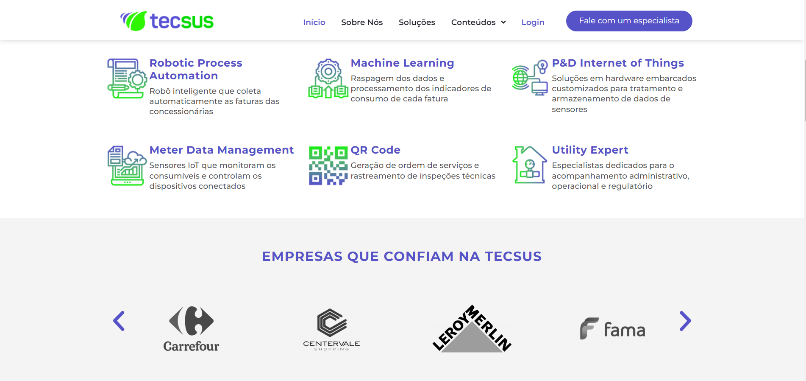
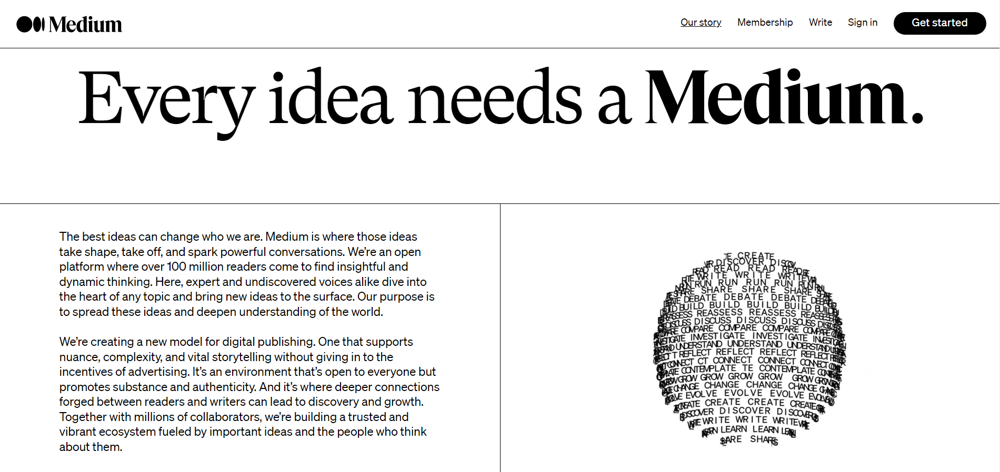
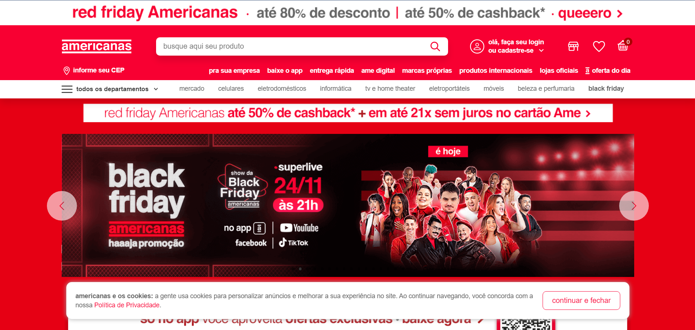
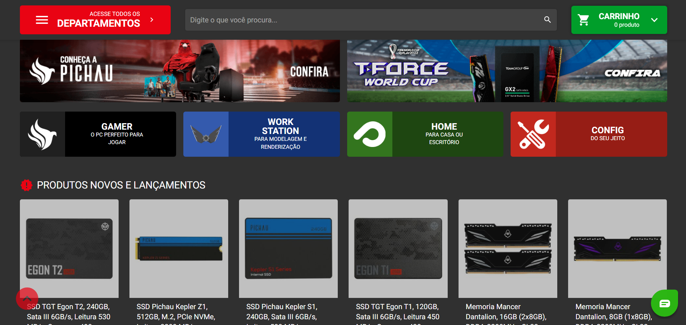
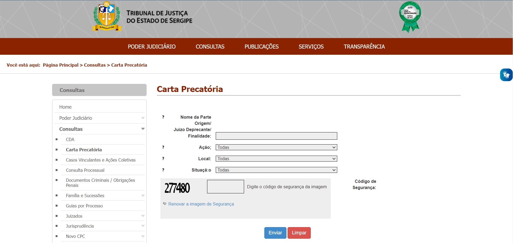

<h1 align="center">
  IHC - Heurísticas WCAG
</h1>

# Acertos
## 3.2.4 - Identificação Consistente  &  2.4.11 - Focus Appearance (Minimum)
 
Para uma navegação consistente entre as pags. o site possui icones e tags com funções semelhantes e aplica "bold" na Tag da aba atual em que o usuário se encontra, utilizando, portanto, de padrões e garantindo que o foco seja explicitado.

## 1.4.3 - Contraste (Minimum) & 3.2.4 - Identificação Consistente  &  2.4.11 - Focus Appearance (Minimum)
 
Assim como o primeiro, este site também aplica "bold" sobre a tag atual, afim de auxiliar o usuário em sua localização, além de possuir um bom contraste de cores e um padrão para tags que façam a mesma função, exemplo: Todas as tags da nav são um link, enquanto logo abaixo, há apenas texto com a mesma formatação.

## 1.3 - Adaptável
 
O LinkedIn é um ótimo exemplo de site responsivel, alterando a disposição da informação em column, sem a perda da mesma e de forma simples.

<!-- 
 -->

  
   

## Heurística Nielsen Norman - 8 Design estético e minimalista & 1.4.3 - Contraste (Enhanced) & 3.2.4 - Identificação Consistente
 
O Site da Medium por sua vez, possui um bom contraste (Fundo branco e letras pretas é muito melhor que o oposto), faz uso de identificação consistente, a medida que sublinha a tag em que o usuário se encontra e consegue deixar claro o que é link, botão e apenas texto. Fora tudo, ele também se enquadra dentro da euristica de Nielsen a medida que possui um design simple e claro com a marca registrada da empresa (Estas formas geometricas formadas por palavras que você encontra pelo site).

# Erros

## 1.4.3 - Contraste (Minimum)
As cores do fundo com a do texto possuem uma taxa de contraste muito baixa, fazendo com que o usuário tenha dificuldade em ler o que está escrito.

## 2.2.4 - Interrupções
Site com muitas propagandas (Interrupções), sendo que algumas não são possíveis fechar por completo e outras apenas aparecem na sua tela do nada.

## 1.3 - Adaptável
Estes sites não possuem uma versão mobile (Não são responsíveis) e/ou não possuem as dimensões corretas de resolução padrão.

## 1.4.1 - Uso de cores
E este em especifico, além de estar fora de proporção e não ser responsivel, também infringe a Heuristica 1.4 Destinguivel
  

## 1 - Perceptível & 1.1 – Alternativas de Texto & 1.1.1 - Conteúdo não textual & 1.4.11 - Contraste não textual
Estes sites por sua vez possuem muitas informações, tanto escritas quanto não textuais, desorganizando a informação e confundindo o usuário, além de poluir a tela e criar um contraste não textual desagradável.

## Heurística Nielsen Norman - 8 Design estético e minimalista
Este site é de fato "minimalista" se levar em conta que não há informações irrelevantes ou raramente necessárias, porém, o mesmo peca em questão de organização e estética, em vista de que ele dispõe mal os campos de input e seus respectivos labels

