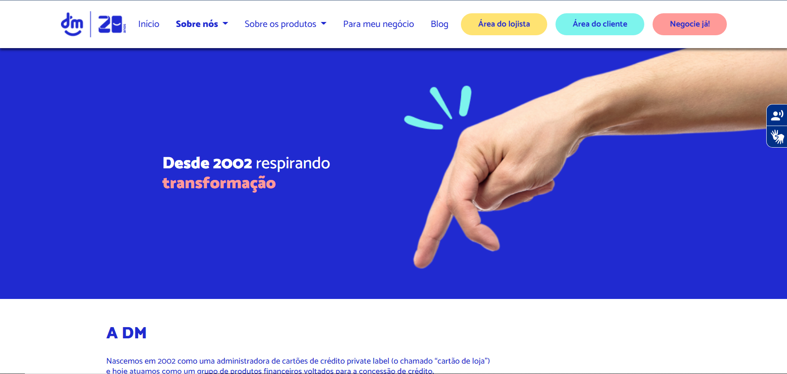

# Heurísticas WCAG

# Acertos
## 3.2.4 - Identificação Consistente & 2.4.11 - Focus Appearance
 
Para uma navegação consistente entre as pags. o site possui icones e tags com funções semelhantes e aplica "bold" na Tag da aba atual em que o usuário se encontra, utilizando, portanto, de padrões e garantindo que o foco seja explicitado com o contorno

# Erros

## 3.1.5 - Compreensivel / Legivel / Nível de leitura

Por ser um site cheio de informações sobre euristicas, os itens tendem a ficar juntos na maioria das vezes, fazendo assim você voltar para o inicio do texto/topico para relembrar onde está

## 1.1.1 Percepitivel / Texto Alternativo / Texto sem contexto

Para o usuario que entrar no site, ele provavelmente irá sair imediatamente, pois não tem como descobrir o que está passando dentro do propio website, além das coisas não carregarem os texto não estão nem legiveis para ter um contexto do mesmo.

## 1.4.3 Percepitivel / Distinguíveis / Contraste

Por ser um site já de fundo branco, os textos serem quase da mesma tonalidade do fundo acaba fazendo o usuario forçar para tentar compreender o que está escrito dentro das caixas de informação 

### WCAG Contrast checker

