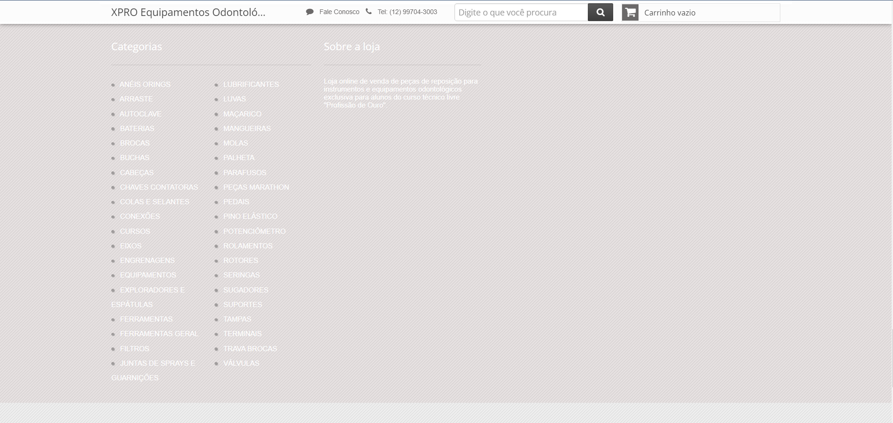
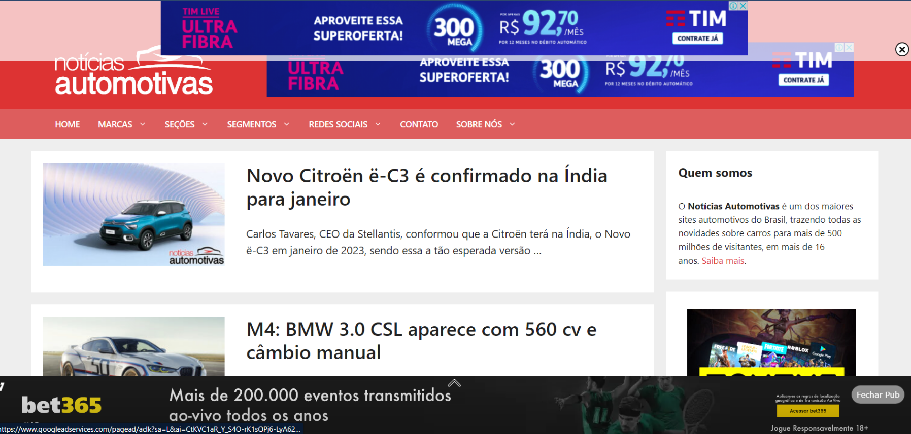
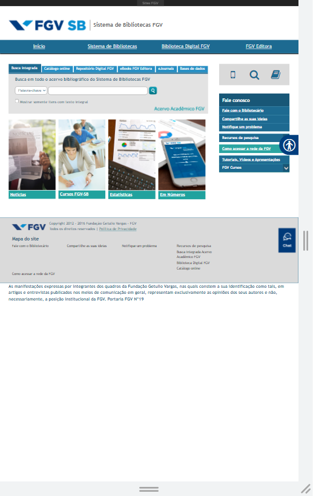
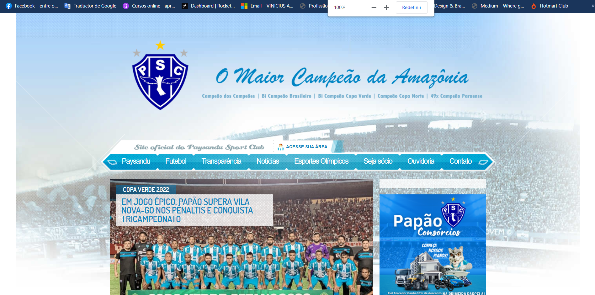
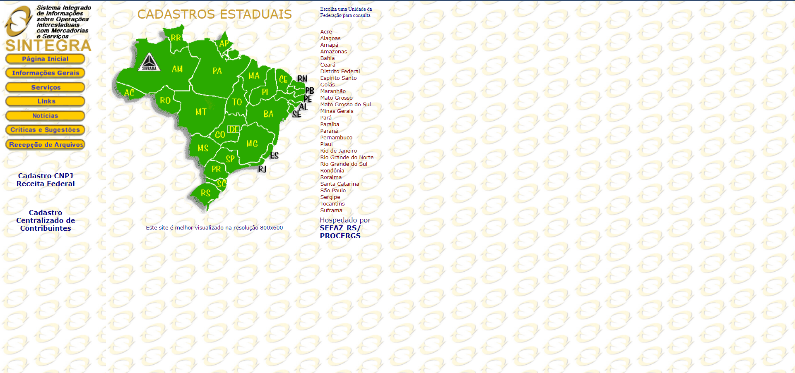

<h1 align="center">
  IHC - Heurísticas WCAG
</h1>

# Acertos
### 3.2.4 - Identificação Consistente & 2.4.11 - Focus Appearance (Minimum)
 
Para uma navegação consistente entre as pags. o site possui icones e tags com funções semelhantes e aplica "bold" na Tag da aba atual em que o usuário se encontra, utilizando, portanto, de padrões e garantindo que o foco seja explicitado com o contorno.

# Erros

## 1.4.3 - Contraste (Minimum)
As cores do fundo com a do texto possuem uma taxa de contraste muito baixa, fazendo com que o usuário tenha dificuldade em ler o que está escrito.

## 2.2.4 Interrupções
Site com muitas propagandas (Interrupções), sendo que algumas não são possíveis fechar por completo e outras apenas aparecem na sua tela do nada.

## 1.3 - Adaptável
Estes sites não possuem uma versão mobile (Não são responsíveis) e/ou não possuem as dimensões corretas de resolução padrão.

E este em especifico, além de estar fora de proporção e não ser responsivel, também infringe a Heuristica 1.4 Destinguivel - Mais especificamente 
  ## 1.4.1 Uso de cores

## 1.4.3 Percepitivel / Distinguíveis / Contraste

## 1.4.3 Percepitivel / Distinguíveis / Contraste

